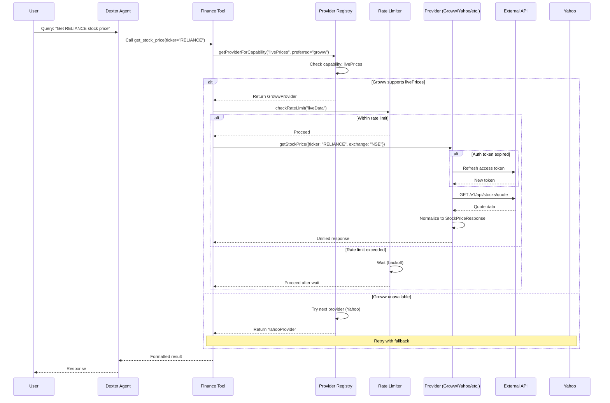
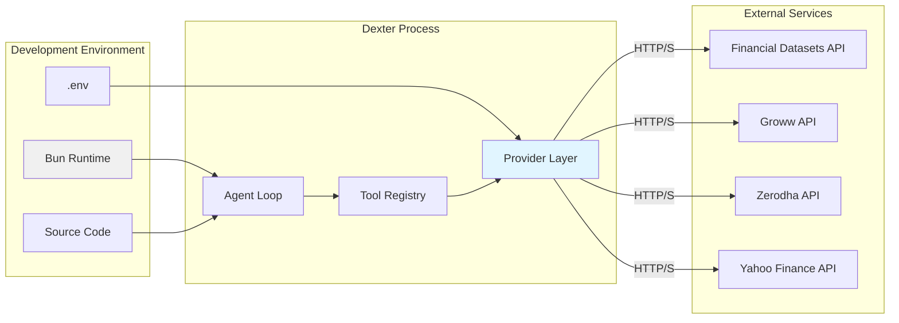

# Architecture: Dexter Provider Abstraction Layer

**Project:** dexter-indian-api-integration  
**Phase:** Architecture  
**Created:** February 28, 2026  
**Author:** ARES (Software Architect)  
**Task ID:** jx716wkp58dd65w6gas0cqxcks821stw  
**Workflow Run ID:** kn775k2v3ant0jqmhtffqwchcd8218vt

---

## 1. Executive Summary

### 1.1 Architecture Goal

Design and implement a **provider-agnostic financial data abstraction layer** for Dexter that enables:
- Multi-provider support (Financial Datasets, Groww, Zerodha, Yahoo Finance)
- Hot-swappable data sources based on capability and market
- Automatic failover and rate limiting
- Backward compatibility with existing tools

### 1.2 Architecture Decisions (TL;DR)

| Decision | Rationale |
|----------|-----------|
| **Adapter Pattern** for providers | Clean separation, testable, extensible |
| **TypeScript + Zod** for type safety | Leverage existing stack, catch errors at compile time |
| **In-Memory Rate Limiting** | Simple, stateless, no external dependencies |
| **Capability-Based Routing** | Provider selection based on feature support |
| **Environment-Based Auth** | Secure, 12-factor app compliant |

---

## 2. System Architecture

### 2.1 Component Diagram

```mermaid
graph TB
    subgraph "Dexter Agent Layer"
        Agent[Agent Loop]
        ToolExecutor[Tool Executor]
        PromptManager[Prompt Manager]
    end

    subgraph "Finance Tools Layer"
        FinancialSearch[Financial Search Meta-Tool]
        FinancialMetrics[Financial Metrics Meta-Tool]
        StockPrice[Stock Price Tool]
        Fundamentals[Fundamentals Tool]
    end

    subgraph "Provider Abstraction Layer"
        ProviderRegistry[Provider Registry]
        RateLimiter[Rate Limiter]
    end

    subgraph "Provider Implementations"
        FDProvider[Financial Datasets Provider]
        GrowwProvider[Groww Provider]
        ZerodhaProvider[Zerodha Provider]
        YahooProvider[Yahoo Finance Provider]
    end

    subgraph "External APIs"
        FDAPI[Financial Datasets API]
        GrowwAPI[Groww Trading API]
        ZerodhaAPI[Zerodha Kite Connect]
        YahooAPI[Yahoo Finance]
    end

    Agent --> ToolExecutor
    ToolExecutor --> FinancialSearch
    ToolExecutor --> FinancialMetrics
    ToolExecutor --> StockPrice
    ToolExecutor --> Fundamentals

    FinancialSearch --> ProviderRegistry
    FinancialMetrics --> ProviderRegistry
    StockPrice --> ProviderRegistry
    Fundamentals --> ProviderRegistry

    ProviderRegistry --> RateLimiter
    ProviderRegistry --> FDProvider
    ProviderRegistry --> GrowwProvider
    ProviderRegistry --> ZerodhaProvider
    ProviderRegistry --> YahooProvider

    RateLimiter -->|Throttle| FDProvider
    RateLimiter -->|Throttle| GrowwProvider
    RateLimiter -->|Throttle| ZerodhaProvider
    RateLimiter -->|Throttle| YahooProvider

    FDProvider -->|HTTPS + API Key| FDAPI
    GrowwProvider -->|HTTPS + Bearer Token| GrowwAPI
    ZerodhaProvider -->|HTTPS + Access Token| ZerodhaAPI
    YahooProvider -->|HTTPS (No Auth)| YahooAPI

    style ProviderRegistry fill:#e1f5ff
    style RateLimiter fill:#fff4e1
```

### 2.2 Data Flow Diagram



### 2.3 Deployment Architecture



---

## 3. Technology Stack

### 3.1 Core Technologies

| Component | Technology | Rationale |
|-----------|-----------|-----------|
| **Runtime** | Bun 1.x | Fast, compatible with Node.js, built-in TypeScript |
| **Language** | TypeScript 5.x | Type safety, existing codebase, tooling |
| **Schema Validation** | Zod 3.x | Existing in Dexter, runtime type checking |
| **HTTP Client** | Native `fetch` | Built into Bun, no extra dependencies |
| **Crypto** | Node `crypto` module | Checksum generation for Groww auth |
| **Logging** | Existing Dexter logger | Consistent logging across app |

### 3.2 Provider-Specific Dependencies

| Provider | Dependency | Version | Purpose |
|----------|------------|---------|---------|
| Financial Datasets | None (built-in fetch) | - | REST API client |
| Groww | None (built-in crypto) | - | Auth checksum, REST API |
| Zerodha | `kiteconnect` (optional) | ^3.0 | Official TypeScript SDK |
| Yahoo Finance | `yahoo-finance2` | ^2.0 | Existing dependency |

### 3.3 Tech Stack ADRs

#### ADR-001: Adapter Pattern for Provider Abstraction
**Status:** Accepted

**Context:**
- Dexter currently has tightly coupled implementations for Financial Datasets API and Yahoo Finance
- Need to support multiple providers (Groww, Zerodha) with different capabilities
- Tools should be unaware of provider-specific implementation details

**Decision:**
- Implement Adapter Pattern with `FinancialDataProvider` interface
- Each provider implements the interface and normalizes responses to common data models
- Provider Registry manages provider lifecycle and routing

**Consequences:**
- ✅ Clean separation of concerns
- ✅ Easy to add new providers
- ✅ Testable via mocking
- ✅ Hot-swappable providers
- ❌ Additional abstraction layer overhead (minimal)
- ❌ Requires initial refactoring effort

#### ADR-002: In-Memory Rate Limiting
**Status:** Accepted

**Context:**
- External APIs have strict rate limits (e.g., Groww: 10/sec, 300/min for live data)
- Need to prevent API blocking and ensure graceful degradation
- Single-process deployment (no distributed system)

**Decision:**
- Implement in-memory rate limiter with sliding window
- Track request timestamps per provider and endpoint type
- Automatic backoff when approaching limits

**Consequences:**
- ✅ Simple implementation, no external dependencies
- ✅ Fast, in-process checks
- ✅ Meets requirements for single-process app
- ❌ State lost on restart (acceptable, limits reset by providers)
- ❌ Not scalable for multi-process deployments (future consideration)

#### ADR-003: Capability-Based Routing
**Status:** Accepted

**Context:**
- Providers have different capabilities (e.g., Groww: live prices + orders, Financial Datasets: fundamentals)
- Need to route queries to appropriate provider based on requested capability
- Indian market queries should prefer Indian providers

**Decision:**
- Define `ProviderCapabilities` interface with feature flags
- Implement `getProviderForCapability(capability, preferredProvider)` in registry
- Automatic fallback to next capable provider if preferred fails

**Consequences:**
- ✅ Intuitive routing logic
- ✅ Graceful degradation
- ✅ Market-aware routing (IN vs US)
- ❌ Requires accurate capability documentation per provider

#### ADR-004: Environment-Based Authentication
**Status:** Accepted

**Context:**
- Multiple providers require different auth mechanisms (API keys, tokens, TOTP)
- Need secure credential storage
- No user authentication system in Dexter (Phase 1)

**Decision:**
- Load all credentials from environment variables
- Never persist credentials to disk
- Implement automatic token refresh for Groww (expires 6:00 AM daily)

**Consequences:**
- ✅ Follows 12-factor app principles
- ✅ Secure (credentials never in code or logs)
- ✅ Easy rotation without code changes
- ❌ Requires environment setup per deployment
- ❌ No per-user credential isolation (acceptable for Phase 1)

---

## 4. Module Design

### 4.1 Module Hierarchy

```
src/tools/finance/providers/
├── types.ts                 # Interfaces: Provider, Config, Capabilities, Errors
├── base-provider.ts         # Abstract base class with common functionality
├── rate-limiter.ts          # Rate limiting utility
├── provider-registry.ts     # Provider lifecycle and routing
├── groww-provider.ts        # Groww API implementation
├── zerodha-provider.ts      # Zerodha Kite Connect implementation
├── yahoo-provider.ts        # Yahoo Finance implementation
├── financial-datasets-provider.ts  # Existing API wrapper
└── index.ts                 # Public exports
```

### 4.2 Core Interfaces

#### FinancialDataProvider Interface
```typescript
interface FinancialDataProvider {
  readonly config: ProviderConfig;
  isAvailable(): boolean;
  getCapabilities(): ProviderCapabilities;
  supportsCapability(capability: keyof ProviderCapabilities): boolean;
  getStockPrice(context: ProviderRequestContext): Promise<StockPriceResponse>;
  initialize?(): Promise<void>;  // Optional for providers needing setup
}
```

#### ProviderConfig Interface
```typescript
interface ProviderConfig {
  id: string;
  displayName: string;
  baseUrl: string;
  apiKeyEnvVar?: string;
  apiSecretEnvVar?: string;
  capabilities: ProviderCapabilities;
  rateLimits: Record<string, RateLimitConfig>;
  requiresAuth: boolean;
}
```

#### ProviderCapabilities Interface
```typescript
interface ProviderCapabilities {
  livePrices: boolean;
  historicalData: boolean;
  incomeStatements: boolean;
  balanceSheets: boolean;
  cashFlowStatements: boolean;
  keyRatios: boolean;
  analystEstimates: boolean;
  filings: boolean;
  insiderTrades: boolean;
  companyNews: boolean;
  orderPlacement: boolean;
  positions: boolean;
  holdings: boolean;
  markets: ('US' | 'IN' | 'GLOBAL')[];
}
```

### 4.3 Error Handling Strategy

#### Error Hierarchy
```typescript
class ProviderError extends Error {
  code: ProviderErrorCode;
  provider: string;
  retryable: boolean;
  httpStatus?: number;
  originalError?: unknown;
}

enum ProviderErrorCode {
  AUTH_MISSING = 'AUTH_MISSING',
  AUTH_FAILED = 'AUTH_FAILED',
  RATE_LIMITED = 'RATE_LIMITED',
  NOT_FOUND = 'NOT_FOUND',
  INVALID_INPUT = 'INVALID_INPUT',
  PROVIDER_ERROR = 'PROVIDER_ERROR',
  NETWORK_ERROR = 'NETWORK_ERROR',
}
```

#### Error Handling Flow
1. Provider catches API errors
2. Wraps in `ProviderError` with appropriate code
3. Registry checks `retryable` flag
4. If retryable: try next provider with exponential backoff
5. If non-retryable: fail fast and return error to user

---

## 5. Security Architecture

### 5.1 Credential Management

| Credential Type | Storage | Rotation | Expiry |
|----------------|---------|----------|--------|
| Financial Datasets API Key | Environment variable | Manual | No expiry |
| Groww API Key | Environment variable | Manual | No expiry |
| Groww API Secret | Environment variable | Manual | No expiry |
| Groww Access Token | In-memory only | Auto-refresh | Daily 6:00 AM |
| Zerodha API Key | Environment variable | Manual | No expiry |
| Zerodha Access Token | In-memory only | Manual per session | Session expiry |

### 5.2 Security Controls

- **Credential Access:** Environment variables only, never hardcoded
- **Token Storage:** In-memory only, never persisted
- **Token Transport:** HTTPS for all API calls
- **Checksum Generation:** SHA-256 for Groww auth
- **Rate Limiting:** Prevents API abuse and credential exhaustion
- **Input Validation:** Zod schema validation on all user inputs
- **Audit Logging:** All API calls logged with timestamp and provider (no credentials)

### 5.3 Network Security

- **TLS 1.2+** required for all API communication
- **Certificate validation** enforced by Bun's fetch
- **No plaintext credentials** in logs or error messages
- **Source URLs** included in responses for verification (no credentials)

---

## 6. Rate Limiting Architecture

### 6.1 Rate Limit Strategy

Sliding window algorithm per provider and endpoint type:

```typescript
class RateLimiter {
  private timestamps: Map<string, number[]> = new Map();
  private limits: Map<string, RateLimitConfig> = new Map();

  async waitForToken(endpointType: string): Promise<void> {
    const now = Date.now();
    const timestamps = this.timestamps.get(endpointType) || [];
    
    // Clean old timestamps
    const recentSecond = timestamps.filter(t => now - t < 1000);
    const recentMinute = timestamps.filter(t => now - t < 60000);
    
    // Enforce per-second limit
    if (recentSecond.length >= limit.perSecond) {
      const waitTime = 1000 - (now - recentSecond[0]);
      await sleep(waitTime);
    }
    
    // Enforce per-minute limit
    if (recentMinute.length >= limit.perMinute) {
      const waitTime = 60000 - (now - recentMinute[0]);
      await sleep(waitTime);
    }
    
    // Record this request
    this.timestamps.set(endpointType, [...timestamps, now]);
  }
}
```

### 6.2 Provider-Specific Limits

| Provider | Endpoint Type | Per Second | Per Minute |
|----------|---------------|------------|------------|
| Groww | orders | 10 | 250 |
| Groww | liveData | 10 | 300 |
| Groww | nonTrading | 20 | 500 |
| Zerodha | orders | 10 | 200 |
| Zerodha | historical | 3 | 60 |
| Yahoo Finance | all | 10 | 2000 |
| Financial Datasets | all | 10 | 1000 (estimated) |

---

## 7. Integration Points

### 7.1 Existing Dexter Integration

| File | Change Type | Description |
|------|-------------|-------------|
| `src/tools/finance/api.ts` | Wrap | Deprecate direct calls, wrap with provider |
| `src/tools/finance/stock-price.ts` | Refactor | Use provider registry with fallback |
| `src/tools/finance/fundamentals.ts` | Refactor | Use provider registry |
| `src/tools/finance/financial-search.ts` | Modify | Add provider-aware routing |
| `src/tools/finance/financial-metrics.ts` | Modify | Add provider-aware routing |
| `src/tools/registry.ts` | Modify | Add provider initialization on startup |
| `env.example` | Update | Add new provider env vars |

### 7.2 Backward Compatibility Strategy

1. **Tool Schemas:** No changes to input/output schemas
2. **Default Behavior:** Route to existing provider (Financial Datasets for fundamentals, Yahoo for prices)
3. **Gradual Rollout:** Parallel operation of old and new code during transition
4. **Feature Flags:** Enable provider routing via environment variable
5. **Migration Guide:** Document new features without breaking existing workflows

---

## 8. Deployment Architecture

### 8.1 Runtime Environment

- **Process Type:** Single-process Bun runtime
- **Concurrency:** Async/await with fetch pool
- **Persistence:** No database changes (Phase 1)
- **State:** In-memory rate limiter, in-memory tokens

### 8.2 Environment Configuration

```bash
# Existing (unchanged)
FINANCIAL_DATASETS_API_KEY=your-key

# New - Groww
GROWW_API_KEY=your-groww-api-key
GROWW_API_SECRET=your-groww-api-secret

# New - Zerodha (optional)
ZERODHA_API_KEY=your-zerodha-api-key
ZERODHA_API_SECRET=your-zerodha-api-secret

# New - Provider routing (optional)
ENABLE_PROVIDER_ROUTING=true
DEFAULT_PROVIDER_INDIAN=groww  # or 'zerodha'
DEFAULT_PROVIDER_US=yahoo
```

### 8.3 Health Checks

Provider health monitoring (internal, no external exposure):

```typescript
interface ProviderHealth {
  provider: string;
  available: boolean;
  lastError?: string;
  lastErrorTime?: Date;
  responseTime: number;  // P95 over last 100 requests
  errorRate: number;     // % over last 100 requests
}
```

---

## 9. Scalability Considerations

### 9.1 Current Scope (Phase 1)

| Aspect | Constraint | Rationale |
|--------|------------|-----------|
| Process Type | Single-process | Simplicity, existing architecture |
| Rate Limiting | In-memory | Meets requirements for single process |
| Credential Storage | Environment | 12-factor app, secure |
| Provider Failover | Sequential retries | Simple, meets requirements |

### 9.2 Future Enhancements (Phase 2+)

| Enhancement | Description |
|-------------|-------------|
| **Redis Rate Limiter** | Distributed rate limiting for multi-process deployments |
| **Token Caching** | Persistent token storage with Redis |
| **WebSocket Streaming** | Real-time data via Zerodha WebSocket |
| **Order Placement** | Trading functionality through Groww/Zerodha |
| **User Credentials** | Per-user provider credentials with database |

---

## 10. Performance Requirements

### 10.1 Latency Targets

| Operation | Target (P95) | Measurement |
|-----------|--------------|-------------|
| Live price query | < 2 seconds | End-to-end (provider + normalization) |
| Historical data (1 year) | < 5 seconds | End-to-end |
| Provider failover | < 3 seconds | Total failover time |
| Rate limit check | < 10ms | In-memory operation |

### 10.2 Concurrency Targets

| Metric | Target | Rationale |
|--------|--------|-----------|
| Concurrent requests | 50 | Without degradation |
| Providers active | 4 | All providers available simultaneously |
| Rate limiter accuracy | ±5% | Within acceptable tolerance |

---

## 11. Monitoring & Observability

### 11.1 Metrics to Track

| Metric | Type | Description |
|--------|------|-------------|
| `provider_request_duration_ms` | Histogram | Request duration per provider |
| `provider_requests_total` | Counter | Total requests per provider |
| `provider_errors_total` | Counter | Errors per provider and error code |
| `provider_rate_limit_waits_total` | Counter | Rate limit throttles |
| `provider_fallback_total` | Counter | Failover events |
| `provider_health_status` | Gauge | Available/unavailable per provider |

### 11.2 Logging

**Structured Logging Format:**
```json
{
  "timestamp": "2026-02-28T20:12:00.000Z",
  "level": "info",
  "provider": "groww",
  "operation": "getStockPrice",
  "ticker": "RELIANCE",
  "duration_ms": 523,
  "status": "success"
}
```

**Log Levels:**
- `error`: Provider failures, auth errors, non-retryable errors
- `warn`: Rate limit throttles, fallback events, capability mismatches
- `info`: Provider selection, successful requests, token refreshes
- `debug`: Detailed request/response data (only in dev)

---

## 12. Testing Strategy

### 12.1 Unit Tests

- **Provider Interfaces:** Mock implementations for all providers
- **Rate Limiter:** Edge cases (limits hit, cleanup, concurrent requests)
- **Registry:** Provider selection, fallback logic, capability routing
- **Error Handling:** All error codes, retryable vs non-retryable

### 12.2 Integration Tests

- **Provider Initialization:** Auth, token refresh, availability checks
- **Real API Calls:** Test with sandbox/test credentials per provider
- **End-to-End:** Tool → Registry → Provider → API → Response

### 12.3 Contract Tests

- **Response Normalization:** Verify unified output format per provider
- **Schema Validation:** Zod schema validation on all inputs
- **Capability Compliance:** Ensure providers deliver advertised capabilities

---

## 13. Migration Plan

### 13.1 Phase 1: Parallel Operation (Week 1-2)

1. Implement provider abstraction layer
2. Create Financial Datasets provider wrapper
3. Create Yahoo Finance provider wrapper
4. Run old and new code in parallel (feature flag)
5. Validate parity with existing behavior

### 13.2 Phase 2: Groww Integration (Week 3-4)

1. Implement Groww provider
2. Add test credentials
3. Test with real Indian market data
4. Update routing logic for Indian markets

### 13.3 Phase 3: Zerodha Integration (Week 5-6)

1. Implement Zerodha provider
2. Add test credentials
3. Test capability matrix
4. Update fallback ordering

### 13.4 Phase 4: Deprecation (Week 7-8)

1. Remove old api.ts direct calls
2. Clean up deprecated code
3. Update documentation
4. Full rollout of provider routing

---

## 14. Risks & Mitigations

| Risk | Likelihood | Impact | Mitigation |
|------|------------|--------|------------|
| Groww API instability | Medium | High | Fallback to Zerodha/Yahoo |
| Rate limit exhaustion | Medium | Medium | Proactive rate limiter |
| Token expiry during operation | Low | High | Auto-refresh, proactive renewal |
| Breaking API changes | Low | High | Version pinning, integration tests |
| Credential exposure | Low | Critical | Env vars only, audit logging |
| Performance degradation | Low | Medium | P95 monitoring, alerting |

---

## 15. ADR Summary

All major architectural decisions documented inline in Section 3.3. Summary:

| ADR | Decision | Status |
|-----|----------|--------|
| ADR-001 | Adapter Pattern for Provider Abstraction | Accepted |
| ADR-002 | In-Memory Rate Limiting | Accepted |
| ADR-003 | Capability-Based Routing | Accepted |
| ADR-004 | Environment-Based Authentication | Accepted |

---

## 16. References

- **Requirements:** `docs/Requirements.md`
- **Architecture Research:** `docs/Dexter_Groww_API_Architecture.md`
- **Dexter Codebase:** `src/tools/finance/`
- **Provider Documentation:**
  - [Groww Trading API](https://groww.in/user/profile/trading-apis)
  - [Zerodha Kite Connect](https://kite.trade)
  - [Yahoo Finance npm](https://github.com/gadicc/node-yahoo-finance2)

---

*Document Version: 1.0*  
*Next Phase: Technical Design (Hephaestus)*
