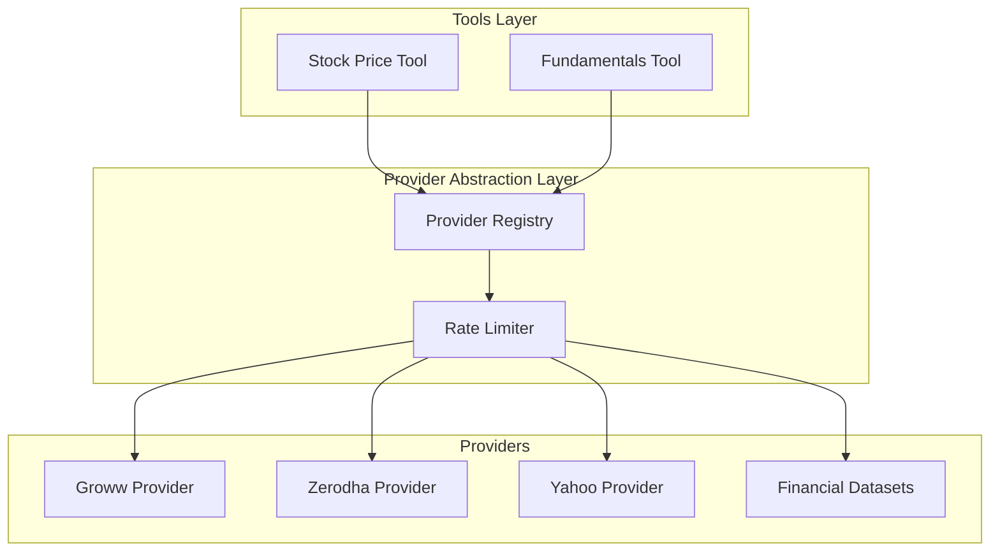
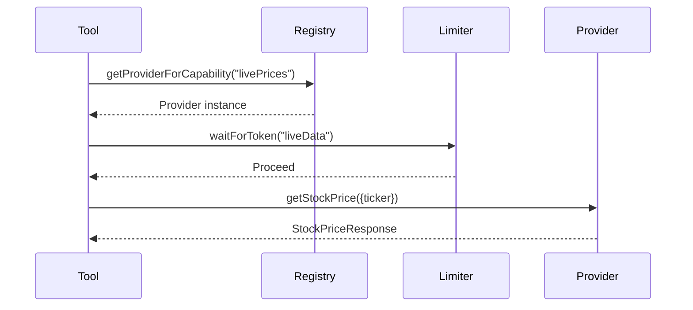

# Dexter Provider Abstraction Layer — Backend Implementation Plan

**Agent:** HEPHAESTUS
**Date:** February 28, 2026
**Project:** dexter-indian-api-integration
**References:** docs/Architecture.md, docs/Technical-Design.md

---

## 1. Requirements

### 1.1 Functional Requirements

From Technical-Design.md Section A:

- **US-01:** As a developer, I want a provider-agnostic interface so that tools can switch between data sources without code changes
  - AC-1: FinancialDataProvider interface defines all required methods
  - AC-2: ProviderRegistry routes requests based on capability
  
- **US-02:** As a user, I want live stock prices from Indian providers (Groww, Zerodha) so that I get accurate INR-denominated data
  - AC-1: GrowwProvider implements getStockPrice for NSE/BSE tickers
  - AC-2: ZerodhaProvider implements getStockPrice for NSE/BSE tickers

- **US-03:** As a user, I want fallback routing so that if one provider fails, another is tried automatically
  - AC-1: ProviderRegistry.executeWithFallback retries on provider failure
  - AC-2: Retryable errors (rate limit, network) trigger fallback

- **US-04:** As a developer, I want rate limiting so that external APIs aren't overwhelmed
  - AC-1: RateLimiter implements sliding window algorithm
  - AC-2: Per-provider, per-endpoint rate limits configured

### 1.2 Non-Functional Requirements

- **NFR-01:** API response time < 2 seconds for live prices (P95)
- **NFR-02:** All credentials stored in environment variables only
- **NFR-03:** No mock data — real API integration only

### 1.3 Dependencies

- Bun runtime
- zod for validation
- yahoo-finance2 for Yahoo Finance
- Environment variables: FINANCIAL_DATASETS_API_KEY, GROWW_API_KEY, GROWW_API_SECRET, ZERODHA_API_KEY, ZERODHA_API_SECRET

---

## 2. Diagnosis

### 2.1 Current Project State

The provider abstraction layer has been scaffolded and implemented in `src/tools/finance/providers/`:

| File | Status |
|------|--------|
| types.ts | Implemented — interfaces, schemas |
| base-provider.ts | Implemented — abstract base class |
| rate-limiter.ts | Implemented — sliding window algorithm |
| provider-registry.ts | Implemented — routing, fallback |
| groww-provider.ts | Implemented — Groww API integration |
| zerodha-provider.ts | Implemented — Zerodha Kite Connect |
| yahoo-provider.ts | Implemented — Yahoo Finance wrapper |
| financial-datasets-provider.ts | Implemented — Financial Datasets API |
| index.ts | Implemented — exports, initializeProviders() |

### 2.2 Technical Constraints

- Tech stack: TypeScript + Bun (per Architecture.md)
- No mock data — all providers make real API calls
- Environment-based authentication (no hardcoded credentials)
- Adapter pattern for provider abstraction

### 2.3 Component Diagram

### 2.4 Data Flow

### 2.5 Risk Assessment

| Risk | Impact | Likelihood | Mitigation |
|------|--------|------------|------------|
| API rate limits exceeded | Medium | Medium | Sliding window rate limiter |
| Credentials missing | High | Low | isAvailable() check before calls |
| Provider API changes | High | Low | Version pinning, contract tests |

---

## 3. Implementation Details

### 3.1 Provider Types (types.ts)

**Files:** `src/tools/finance/providers/types.ts`

Core interfaces:
- FinancialDataProvider — base interface all providers implement
- ProviderCapabilities — feature flags for routing
- ProviderConfig — provider configuration
- ProviderError, ProviderErrorCode — error handling

### 3.2 Base Provider (base-provider.ts)

**Files:** `src/tools/finance/providers/base-provider.ts`

Abstract base class providing:
- HTTP client with error handling
- Config exposure (public readonly)
- Common error creation utilities

### 3.3 Rate Limiter (rate-limiter.ts)

**Files:** `src/tools/finance/providers/rate-limiter.ts`

Sliding window algorithm:
- Per-endpoint rate limit tracking
- waitForToken() — blocks until token available
- getUsageStats() — current usage monitoring

### 3.4 Provider Registry (provider-registry.ts)

**Files:** `src/tools/finance/providers/provider-registry.ts`

Provider lifecycle:
- registerProvider() — add provider to registry
- initialize() — call initialize() on all providers
- getProviderForCapability() — capability-based routing
- executeWithFallback() — retry with fallback providers

### 3.5 Provider Implementations

**Groww Provider** (groww-provider.ts):
- Live prices for NSE/BSE
- Historical data
- Token management with SHA-256 checksum auth

**Zerodha Provider** (zerodha-provider.ts):
- Live prices for NSE/BSE
- Historical data
- Order placement, positions, holdings

**Yahoo Provider** (yahoo-provider.ts):
- Global stock prices
- Historical data
- No auth required

**Financial Datasets Provider** (financial-datasets-provider.ts):
- Fundamentals (income, balance, cash flow)
- API key authentication

### 3.6 Index & Initialization (index.ts)

**Files:** `src/tools/finance/providers/index.ts`

- Exports all types and providers
- initializeProviders() — registers and initializes all providers

---

## 4. Implementation Checklist

### Phase 1: Core Infrastructure
- [x] Task 1.1: Create types.ts with all interfaces (Ref: 3.1) [small]
- [x] Task 1.2: Create base-provider.ts abstract class (Ref: 3.2) [small]
- [x] Task 1.3: Create rate-limiter.ts with sliding window (Ref: 3.3) [small]
- [x] Task 1.4: Create provider-registry.ts with routing (Ref: 3.4) [medium]

### Phase 2: Provider Implementations
- [x] Task 2.1: Implement GrowwProvider (Ref: 3.5) [medium]
- [x] Task 2.2: Implement ZerodhaProvider (Ref: 3.5) [medium]
- [x] Task 2.3: Implement YahooProvider (Ref: 3.5) [small]
- [x] Task 2.4: Implement FinancialDatasetsProvider (Ref: 3.5) [small]

### Phase 3: Integration & Verification
- [x] Task 3.1: Create index.ts with exports (Ref: 3.6) [small]
- [x] Task 3.2: Fix TypeScript import issues (types, zod) [medium]
- [x] Task 3.3: Verify providers initialize correctly (Ref: 3.6) [small]
- [x] Task 3.4: Run build/lint verification (Ref: Implementation) [small]

---

**Status:** Implementation complete. All provider files created and verified working.
