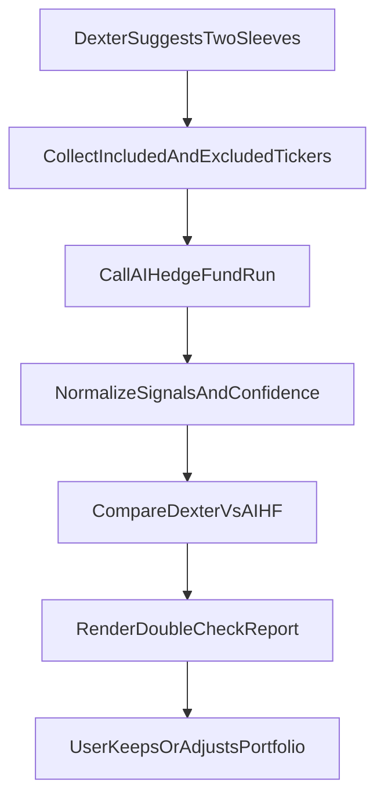

# PRD: AI Hedge Fund Double-Check for Dexter Suggestions

**Version:** 1.0  
**Status:** Draft  
**Last Updated:** 2026-03-08

---

## 1. Executive Summary

Use [AI Hedge Fund](https://github.com/eliza420ai-beep/ai-hedge-fund) as a **second-opinion validator** for Dexter’s two-sleeve portfolio suggestions. When Dexter proposes a tastytrade sleeve and a Hyperliquid sleeve (with included positions and a “Not in the portfolio — and why” exclusion list), we run the same tickers through AIHF’s 18 analyst agents + risk/portfolio manager and compare outcomes. The result is an advisory **double-check report**: agreement score, high-conviction conflicts, and “excluded but interesting” names. This is **research and decision-support only** — no auto-execution or auto-revision of portfolios.

---

## 2. Objective and Validation Goal

- **Verify** Dexter’s proposed allocations against independent multi-agent signals from AIHF.
- **Evaluate both:**
  - **Included names** — Why each ticker is in the portfolio; does AIHF agree or disagree?
  - **Excluded names** — Why each was left out; does AIHF strongly favor any of them?
- **Deliver** a structured double-check summary so the user can keep, adjust, or reject Dexter’s suggestion with full context.

---

## 3. Scope Boundaries

| In scope | Out of scope |
|----------|---------------|
| Suggestion-time validation (after Dexter suggests two sleeves) | Auto-execution of trades or portfolio writes |
| Optional periodic re-check (heartbeat) of current portfolios | Merging Dexter and AIHF codebases |
| Excluded tickers as first-class validation objects | Replacing Dexter’s suggestion flow with AIHF |
| Advisory report only; user keeps final decision | AIHF as sole source of portfolio construction |

---

## 4. Architecture and Validation Flow



- **Dexter suggests** two sleeves (tastytrade + Hyperliquid) and a “Not in the portfolio — and why” list.
- **Collect** all included tickers (per sleeve) and excluded tickers (with Dexter’s reason).
- **Call** AIHF `/hedge-fund/run` with the combined ticker set (or per-sleeve if we want sleeve-specific runs).
- **Normalize** AIHF’s per-ticker decisions and analyst signals into a consistent confidence/signal format.
- **Compare** Dexter’s inclusion/exclusion and weights vs AIHF’s BUY/SELL/HOLD and confidence.
- **Render** double-check report (summary, conflicts, excluded-but-interesting, optional revisions).
- **User** keeps or adjusts the portfolio; no automatic overwrite of PORTFOLIO.md or PORTFOLIO-HYPERLIQUID.md.

---

## 5. Comparison Model

### 5.1 Input (from Dexter)

- **Sleeve A (tastytrade):** List of tickers with target weights (and optional layer/tier).
- **Sleeve B (Hyperliquid):** List of tickers with target weights (and optional category/notes).
- **Excluded list:** Tickers considered but left out, each with a one-line reason (e.g. crowding, valuation, overlap).

### 5.2 AIHF Output (from `/hedge-fund/run`)

- **decisions:** Portfolio manager’s final per-ticker decision (e.g. BUY/SELL/SHORT/COVER/HOLD, quantity, confidence).
- **analyst_signals:** Per-agent, per-ticker signals (bullish/bearish/neutral + confidence/reasoning).

### 5.3 Derived Checks

| Check | Description |
|-------|-------------|
| **Agreement score** | For each included ticker: Dexter says “in” with weight X; AIHF says BUY/HOLD vs SELL/SHORT. Compute % of included names where AIHF aligns (e.g. BUY or HOLD with confidence above threshold). |
| **Conflict flags** | Tickers where Dexter included them but AIHF signals strong SELL/SHORT (or vice versa: Dexter excluded, AIHF strong BUY). Surface as “High-Conviction Conflicts.” |
| **Exclusion audit** | For each excluded ticker: AIHF’s aggregate signal and confidence. If AIHF is strongly bullish, list under “Excluded But Interesting” so the user can revisit. |

### 5.4 Confidence Normalization

- AIHF returns analyst-level and portfolio-manager-level confidence (format may vary by agent).
- For comparison, define a **normalized confidence** in [0, 1]:
  - Map BUY/HOLD to positive, SELL/SHORT to negative; scale by reported confidence or count of agreeing analysts.
- Document the exact mapping in the implementation (e.g. in the Dexter tool or shared types) so the report is deterministic.

---

## 6. Output Contract to User

The double-check report MUST include:

| Section | Content |
|---------|---------|
| **Double-Check Summary** | One paragraph: how many tickers agreed, how many conflicts, and whether excluded list was audited. |
| **High-Conviction Conflicts** | Table or list: ticker, sleeve, Dexter’s stance (in/out, weight or reason), AIHF’s stance (e.g. SELL 85%), brief note. |
| **Excluded But Interesting** | Table or list: ticker, Dexter’s reason for exclusion, AIHF’s signal (e.g. BUY 80%), optional “consider revisiting” note. |
| **Actionable Revisions (optional)** | If we implement suggestion generation: 1–3 concrete changes (e.g. “Consider adding MU to HL sleeve; AIHF bullish.”). Optional so P0 can omit it. |

---

## 7. Data and Schema Requirements

### 7.1 Input Payload (Dexter → Validator)

Standardized so the same shape works for manual bridge, tool wrapper, and heartbeat.

```json
{
  "sleeve_default": {
    "tickers": ["AMAT", "ASML", "LRCX"],
    "weights": [14, 12, 10],
    "layer_tier": ["Equipment | Core Compounder", "Equipment | Core Compounder", "Equipment | Core Compounder"]
  },
  "sleeve_hyperliquid": {
    "tickers": ["TSM", "NVDA", "PLTR"],
    "weights": [16, 10, 8],
    "category_notes": ["Foundry | ...", "AI infra | ...", "AI infra | ..."]
  },
  "excluded": [
    { "ticker": "MU", "reason": "Real upside, but muddies cleaner TSM + tokenization structure." },
    { "ticker": "AVGO", "reason": "Good business, weaker expression than equipment + ANET." }
  ]
}
```

### 7.2 AIHF Request (Dicker Set for `/hedge-fund/run`)

Combine included + excluded tickers into a single list for one run (or split by sleeve if we want separate runs). Example minimal payload for AIHF:

```json
{
  "tickers": ["AMAT", "ASML", "LRCX", "TSM", "NVDA", "PLTR", "MU", "AVGO"],
  "graph_nodes": [ "... from default template ..." ],
  "graph_edges": [ "... from default template ..." ],
  "initial_cash": 100000,
  "margin_requirement": 0,
  "start_date": null,
  "end_date": "2026-03-08"
}
```

- `graph_nodes` / `graph_edges`: use AIHF’s default pipeline (all 18 analysts → risk manager → portfolio manager). Document or fetch default graph from AIHF (e.g. `GET /flows` or bundled template).

### 7.3 Normalized Comparison Output (Validator → Report)

Minimal response schema for deterministic rendering:

```json
{
  "summary": {
    "included_agreement_pct": 0.85,
    "conflict_count": 2,
    "excluded_interesting_count": 3
  },
  "conflicts": [
    {
      "ticker": "XYZ",
      "sleeve": "default",
      "dexter": "in @ 10%",
      "aihf": "SELL",
      "aihf_confidence": 0.88,
      "note": "AIHF strongly bearish; consider trimming or revisiting thesis."
    }
  ],
  "excluded_interesting": [
    {
      "ticker": "MU",
      "dexter_reason": "Muddies cleaner TSM + tokenization structure.",
      "aihf_signal": "BUY",
      "aihf_confidence": 0.82,
      "suggested_action": "Optional: consider adding to HL sleeve if thesis allows."
    }
  ],
  "optional_revisions": []
}
```

---

## 8. Integration Options (Phased Rollout)

### P0 — Manual Bridge (No Code in Dexter)

| Item | Description |
|------|-------------|
| **Flow** | User runs Dexter `/suggest` (or equivalent), gets two sleeves + exclusion list. User copies included and excluded tickers into AIHF (CLI or web). User runs AIHF, then pastes or compares results manually. |
| **Pros** | No Dexter changes; works today; no latency/cost in Dexter. |
| **Cons** | Friction; no single “double-check” button; user must interpret AIHF output themselves. |
| **Deliverable** | Documentation: “How to double-check Dexter’s suggestion with AI Hedge Fund” (steps, example ticker list, how to read conflicts). |

### P1 — Dexter Tool Wrapper

| Item | Description |
|------|-------------|
| **Flow** | New Dexter tool (e.g. `aihf_double_check`) that accepts the structured input (sleeves + excluded), calls AIHF `POST /hedge-fund/run` (with default graph), waits for completion (or polls/streams), normalizes response, and returns the comparison output. Agent or user invokes it after a portfolio suggestion. |
| **Pros** | Single flow inside Dexter; report is structured and reproducible. |
| **Cons** | Requires AIHF backend reachable (e.g. `AIHF_API_URL`), timeout and retry handling; LLM cost and latency on AIHF side. |
| **Deliverable** | Tool in `src/tools/` (e.g. `aihf/aihf-double-check-tool.ts`), env `AIHF_API_URL`, optional `AIHF_REQUEST_TIMEOUT_MS`; tool description in registry; prompt hint in `prompts.ts` and CLI shortcut optional. |

### P2 — Periodic Validation (Heartbeat)

| Item | Description |
|------|-------------|
| **Flow** | Heartbeat (e.g. weekly) optionally runs a double-check on the **current** portfolios (read from PORTFOLIO.md and PORTFOLIO-HYPERLIQUID.md) plus any stored “excluded” list. If conflicts or excluded-but-interesting exceed a threshold, include a short summary in the heartbeat alert. |
| **Pros** | Ongoing validation without user re-running suggestions. |
| **Cons** | Depends on P1; need to persist “last excluded” or re-derive from last suggestion; more moving parts. |
| **Deliverable** | Heartbeat checklist step or optional “Validate vs AIHF” flag; store last double-check result for display. |

---

## 9. Operational Concerns

| Concern | Mitigation |
|---------|------------|
| **AIHF availability** | Configurable `AIHF_API_URL`; timeout (e.g. 120–300 s); retries (e.g. 1 retry with backoff). On failure, return a clear message (“AIHF double-check unavailable; run manually.”) and do not block saving the portfolio. |
| **Cost and latency** | AIHF run can take 1–3+ minutes and consume LLM credits. Document expected duration; consider caching result by ticker set hash for a short TTL (e.g. 1 hour) so repeated identical requests don’t re-run. |
| **CORS / network** | Dexter server or CLI calling AIHF: ensure AIHF allows the caller’s origin or run from same host. For CLI, same-machine localhost is typical. |
| **Advisory only** | Tool and prompts MUST state that the double-check is for information only; the user decides whether to change the portfolio. No tool may auto-update PORTFOLIO.md or PORTFOLIO-HYPERLIQUID.md based on AIHF. |

---

## 10. Success Metrics

| Metric | Target (to be refined) |
|--------|-------------------------|
| **Suggestions with validation run** | Track % of `/suggest` (or full portfolio suggestion) flows where the user or agent invokes the double-check. |
| **Conflict detection rate** | When double-check runs, how often at least one high-conviction conflict is found. |
| **User-reported utility** | Qualitative: “Did the double-check change your decision?” (survey or feedback). |
| **Availability** | When AIHF is configured, double-check completes without error in &gt; 95% of runs (or gracefully degrades with a clear message). |

---

## 11. Failure Modes and Fallback Behavior

| Failure | Behavior |
|---------|----------|
| AIHF API unreachable | Return: “AIHF double-check unavailable (service unreachable). You can run AIHF manually with these tickers: …” and list tickers. Do not fail the suggestion or save. |
| AIHF timeout | Same as unreachable; suggest manual run. |
| AIHF returns malformed response | Parse best-effort; if decisions/analyst_signals missing, report “AIHF returned incomplete data; partial comparison only.” or “Could not compare; run AIHF manually.” |
| Empty ticker list | Do not call AIHF; return “No tickers to validate.” |
| Partial ticker support | AIHF may not support all symbols (e.g. pre-IPO). Filter to supported tickers for the run; note “The following tickers were not validated by AIHF: …”. |

---

## 12. Test Plan

### 12.1 Deterministic Fixtures

- **Input fixture:** A fixed JSON file (e.g. `tests/fixtures/aihf-double-check-input.json`) with one tastytrade sleeve, one HL sleeve, and an excluded list.
- **Mock AIHF response:** A fixed JSON file (e.g. `tests/fixtures/aihf-double-check-response.json`) with a minimal `decisions` and `analyst_signals` structure that matches what `parse_hedge_fund_response` and the graph’s final message produce.
- **Expected comparison output:** For the above pair, define the expected normalized summary (agreement %, conflict count, excluded-interesting count) and the exact list of conflict and excluded-interesting entries.

### 12.2 Unit Tests (when P1 exists)

- Given input fixture + mock AIHF response, the comparison function (normalize + compare) produces the expected output.
- Given empty excluded list, `excluded_interesting` is empty.
- Given AIHF response with no decisions, the code handles gracefully and does not throw.

### 12.3 Integration Tests (optional)

- With a running AIHF backend and a small ticker list (e.g. AAPL, MSFT), call the double-check tool and assert that the response has `summary` and at least one of `conflicts` or `excluded_interesting` (or both empty). Skip if `AIHF_API_URL` is not set.

---

## 13. Dependencies and References

- [AI Hedge Fund](https://github.com/eliza420ai-beep/ai-hedge-fund) — Backend `POST /hedge-fund/run`, `GET /hedge-fund/agents`, default graph structure.
- [PRD-UNIFIED-FRONTEND-DEXTER-HEDGEFUND.md](PRD-UNIFIED-FRONTEND-DEXTER-HEDGEFUND.md) — High-level integration and API references.
- [EXTERNAL-RESOURCES.md](EXTERNAL-RESOURCES.md) — AI Hedge Fund summary and shared SOUL.md context.
- Dexter: [src/agent/prompts.ts](../src/agent/prompts.ts), [src/cli.ts](../src/cli.ts), [src/tools/portfolio/portfolio-tool.ts](../src/tools/portfolio/portfolio-tool.ts).

---

## 14. Acceptance Criteria for This PRD

- [x] Validation goal clearly states included + excluded ticker evaluation.
- [x] Scope boundaries and “advisory only” are explicit.
- [x] Comparison model (agreement, conflicts, exclusion audit) and output contract are specified.
- [x] P0 / P1 / P2 integration options documented with trade-offs.
- [x] Input and normalized output schemas specified.
- [x] Operational concerns, failure modes, and success metrics covered.
- [x] Test plan with deterministic fixtures and unit/integration outline included.
- [ ] Implementation (P1 tool, prompts, CLI) is out of scope for this PRD; follow-on implementation PR.
