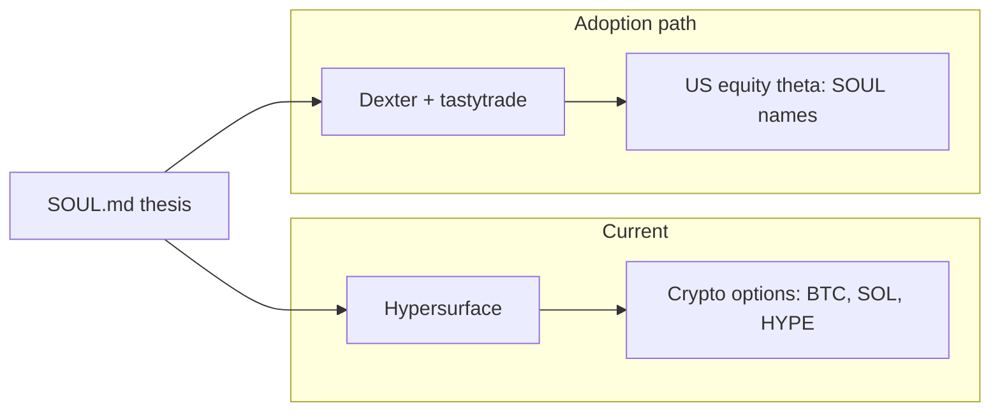

# PRD: Explore Options Trading on tastytrade (Alongside Hypersurface)

**Version:** 1.0  
**Status:** Draft  
**Last Updated:** 2026-03-08  
**Reference:** [PRD-TASTYTRADE-INTEGRATION.md](PRD-TASTYTRADE-INTEGRATION.md) | [PRD-TASTYTRADE-PHASE-5-THETA-ENGINE.md](PRD-TASTYTRADE-PHASE-5-THETA-ENGINE.md) | [THETA-POLICY.md](THETA-POLICY.md) | [TASTYTRADE.md](TASTYTRADE.md)

---

## 1. Executive Summary

**Current state:** Options today are traded on **Hypersurface** for core crypto (BTC, SOL, HYPE, etc.) with a clear web UI: pick strike, see APR, sell/buy probability, and expiration. Dexter already has full **tastytrade** integration (Phases 1–6 shipped): read positions/balances, portfolio sync, theta scan, strategy preview, roll/repair, and optional order submit — but the experience is **CLI/agent-driven** (e.g. `/theta-scan`, `/theta-preview`, dry-run, approve, submit).

**Goal of this PRD:** Explore what is needed — process, documentation, UX, or tooling — to **adopt tastytrade for options** on SOUL thesis names (US equity) alongside Hypersurface, without replacing Hypersurface.

**Out of scope:** Replacing Hypersurface; re-implementing the tastytrade API (already done). **In scope:** adoption path, when-to-use-which-venue, gap analysis, and optional improvements.

---

## 2. Venue Comparison: Hypersurface vs tastytrade (via Dexter)

| Dimension | Hypersurface | tastytrade (Dexter) |
|-----------|---------------|----------------------|
| **Assets** | On-chain (e.g. BTC); tokenized options | US equity options (SOUL thesis names: AMAT, ASML, LRCX, KLAC, VRT, CEG, etc.) |
| **UX** | Web UI: pick strike, see APR, sell/buy probability, expiration | CLI/agent: `/theta-scan`, `/theta-preview`, dry-run, approve, submit |
| **Custody / regulation** | Self-custody, on-chain | Broker (tastytrade), regulated US broker |
| **Hours** | 24/7 | Market hours |
| **Policy** | In-app / manual | THETA-POLICY.md (no-call list, delta/DTE, risk caps, earnings filter) |
| **Overlap** | Core crypto options | No HL-tradable symbols (venue split); thesis names only |

### 2.1 When to use which

- **Hypersurface:** Crypto options (BTC, SOL, HYPE, etc.) — on-chain, 24/7, user-friendly table (strike, APR, probability). Core crypto is held separately from the HL equities sleeve; options on that core live here.
- **tastytrade (via Dexter):** US equity theta on **SOUL thesis names** (equipment, foundry, chip, power, memory, networking, cyclical adjacents). Zero overlap with Hyperliquid: symbols tradable on HL are hard-blocked from tastytrade theta scan, preview, and submit; those belong in PORTFOLIO-HYPERLIQUID.md and HL tools.

**One SOUL thesis, two execution venues** — Hypersurface for crypto options; tastytrade for US equity options on thesis names.

---

## 3. Gap Analysis: What’s Needed to Trade Options on tastytrade

### 3.1 UX gap

Hypersurface offers a **table**: strike, APR, sell/buy probability, expiration, and a “Select” action. Dexter offers **ranked scan output** and **preview** in chat/CLI (candidates with underlying, strategy, strikes, credit, max loss, portfolio_fit, order_json).

**Explore:** Is CLI + THETA-POLICY sufficient for adoption, or do we want a Hypersurface-style “strike / APR / probability” view? Options for follow-on:

- **(a)** Format `tastytrade_theta_scan` output as a **table** in CLI (strike, credit, APR-like yield, probability) so at a glance it resembles Hypersurface’s clarity.
- **(b)** Future small web or dashboard view: “pick strike, see APR/probability” for a chosen underlying. No commitment; list as exploration.

### 3.2 Education / onboarding

What runbooks or docs are needed so someone who uses Hypersurface today can add “theta on tastytrade via Dexter”?

- **Setup:** THETA-POLICY.md in place (copy from [THETA-POLICY.example.md](THETA-POLICY.example.md)); OAuth and credentials ([TASTYTRADE.md](TASTYTRADE.md)).
- **Venue split:** Document that tastytrade sleeve = non-HL names only; HL-tradable tickers are excluded from scan/preview/submit.
- **Flow:** `/theta-scan` → choose candidate → `/theta-preview` → dry-run → approve → submit (when `TASTYTRADE_ORDER_ENABLED=true`). See the one-page runbook: [RUNBOOK-TASTYTRADE-OPTIONS-FROM-HYPERSURFACE.md](RUNBOOK-TASTYTRADE-OPTIONS-FROM-HYPERSURFACE.md).

### 3.3 Ops and risk

Running **two venues** (Hypersurface + tastytrade): single SOUL thesis, two places to check (positions, expirations, roll/repair).

**Explore:**

- Heartbeat “theta check” that can surface: (1) tastytrade short options expiring this week and any roll/repair suggestions; (2) Hypersurface is out of scope for Dexter today — user checks in-app.
- Explicit “where do I have short options?” view: today = `tastytrade_position_risk` for tastytrade; Hypersurface would remain manual or a future integration.

### 3.4 Readiness checklist

Prerequisites to consider before using tastytrade for **live** options:

| Item | Description |
|------|-------------|
| OAuth and credentials | TASTYTRADE_CLIENT_ID, TASTYTRADE_CLIENT_SECRET; refresh token in `~/.dexter/tastytrade-credentials.json` |
| THETA-POLICY.md | Allowed underlyings, no-call list, delta/DTE, max risk, earnings filter; see [THETA-POLICY.md](THETA-POLICY.md) |
| Venue split understood | tastytrade = non-HL names only; HL symbols in PORTFOLIO-HYPERLIQUID.md and HL tools |
| Dry-run habit | Always preview and dry-run before submit; submit only after explicit approval |
| Sandbox (optional) | Test with `TASTYTRADE_SANDBOX=true` and paper account before production |

---

## 4. Optional Future Improvements (Exploration Only)

This section expands the UX and aggregation ideas from §3.1. No commitment to build; the goal is to clarify what “Hypersurface-like clarity” and “unified theta view” would entail so we can prioritize or defer with full context.

### 4.1 Strike / APR / probability display

**Reference:** Hypersurface’s UI shows, per strategy (e.g. covered calls, secured puts), a table: **Strike** (sell or buy price), **APR** (annualized yield), **Sell/Buy probability** (probability of finishing in the money by expiration), and a **Select** action. One glance answers “what return at what risk?” and “which strike do I want?”

Today, Dexter’s `tastytrade_theta_scan` returns **ranked candidates** with underlying, strategy type, strikes, estimated credit, max loss, DTE, delta, portfolio_fit, and order_json. The data needed for a strike/APR/probability view is largely present; the gap is **format and framing** (table, APR-like metric, probability) so it feels like “pick strike, see APR/probability” rather than “read a block of candidate text.”

#### Option (a): Table-format theta_scan in CLI

- **Idea:** When the agent (or a dedicated CLI command) runs theta scan, format the top N candidates as a **markdown or box-drawn table** with columns aligned to Hypersurface’s mental model, e.g.:
  - **Underlying** | **Strategy** | **Strike(s)** | **Credit** | **APR-like** | **Prob (ITM)** | **DTE** | **Max loss**
- **Data sources:** Credit and strikes already come from the scan. **APR-like** = annualize the credit over DTE (e.g. `credit / (notional or buying power) * (365/DTE)` or similar). **Probability** = from tastytrade/option chain if available (e.g. delta-derived or IV-based); if not available, “—” or “N/A” and document the gap.
- **Rendering:** Either (1) the theta_scan tool returns a `table_summary` string in addition to the existing candidate list, or (2) a small formatter in the CLI/agent layer turns the tool output into a table before display. Option (1) keeps “one tool, one contract”; option (2) keeps the tool generic and pushes presentation to the UI layer.
- **Trade-offs:** Table in CLI improves scan-at-a-glance without a new app. APR and probability require consistent definitions and handling of missing data (e.g. no IV) so we don’t mislead. Scope is “display only”; order flow stays preview → dry-run → approve → submit.

#### Option (b): Small web or dashboard view

- **Idea:** A minimal web (or local) view: user picks **underlying** and **strategy type** (e.g. covered call, cash-secured put); backend runs theta scan or option-chain + pricing for that underlying and returns **strike, credit, APR-like, probability**; frontend renders a Hypersurface-style table with a “Select” that could copy payload to clipboard or trigger a “preview this in Dexter” deep link.
- **Scope:** Read-only “pick strike, see APR/probability” for one underlying at a time. No order submission from the dashboard; submission stays in Dexter CLI (or future Dexter UI) after preview/dry-run.
- **Data flow:** Same as (a) for APR and probability. The dashboard would call either (i) Dexter’s existing tools via an HTTP/API wrapper, or (ii) a dedicated “scan one underlying” endpoint that returns table rows. (i) reuses current tooling; (ii) allows a slimmer response schema for the dashboard.
- **Trade-offs:** Better UX for users who prefer a Hypersurface-like flow, but adds a frontend and (if HTTP) an API surface to run and maintain. Out of scope for this PRD is whether that frontend lives in Dexter’s repo, a separate app, or a shared “theta UI” used by both Dexter and other tools.

**Summary (4.1):** (a) = low-friction, CLI-only, table formatting + APR/probability where data exists. (b) = higher-friction, web/dashboard for “pick strike, see APR/probability” with no commitment to when or where it ships.

### 4.2 Unified “theta dashboard” (far future)

- **Idea:** A **single read-only view** of “where do I have short options?” and “what’s expiring when?” across **both** Hypersurface (crypto) and tastytrade (US equity). One place to see all short options, expiration dates, and optionally roll/repair hints (for tastytrade, where we already have roll/repair tools).
- **Why “far future”:** Hypersurface positions are not today exposed via a Dexter or ai-hedge-fund API; we’d need either (1) a Hypersurface API/integration that returns positions and expirations, or (2) manual entry/import (e.g. CSV or form). tastytrade is already covered via `tastytrade_position_risk` and positions/balances. So the “unified” view depends on a Hypersurface data source that is out of scope for this PRD.
- **What it would show (exploration):** For each venue: list of short options (underlying, strike, expiration, side), DTE, and for tastytrade, link to roll/repair or preview. Aggregated calendar view “short options expiring by week” across both venues would reduce context-switching.
- **Dependencies:** Hypersurface position feed or API; shared auth or config for “which Hypersurface account”; same SOUL/thesis context so the dashboard can tag underlyings by thesis layer/tier if desired. No commitment to build; noting here so we don’t forget the idea when Hypersurface integration is revisited.

---

## 5. Success Criteria for “Exploration Complete”

- Venue comparison and “when to use which” are documented.
- Gaps (UX, education, ops) are listed with optional vs required.
- A short readiness checklist exists for turning on tastytrade options with the new setup.
- Any follow-on work (e.g. table-format scan output, runbook) can be scoped from this PRD.

---

## 6. References

| Doc | Purpose |
|-----|---------|
| [PRD-TASTYTRADE-INTEGRATION.md](PRD-TASTYTRADE-INTEGRATION.md) | Full tastytrade integration (Phases 1–6), API, auth, tools |
| [PRD-TASTYTRADE-PHASE-5-THETA-ENGINE.md](PRD-TASTYTRADE-PHASE-5-THETA-ENGINE.md) | Theta engine: scan, preview, roll, repair, THETA-POLICY |
| [TASTYTRADE.md](TASTYTRADE.md) | User guide: setup, tools, theta workflows, venue split |
| [THETA-POLICY.md](THETA-POLICY.md) | Policy format, no-call list, venue split |
| [README.md](../README.md) | Theta logic, venue split, CLI shortcuts |

Hypersurface is referenced as the current on-chain options UX (covered calls, secured puts, APR, probability); there is no formal Hypersurface PRD in this repo.

---

## 7. Out of Scope for This PRD

- Building or changing tastytrade API integration (already implemented).
- Hypersurface API or product changes.
- Commitment to build a specific UI; only explore and document options.
