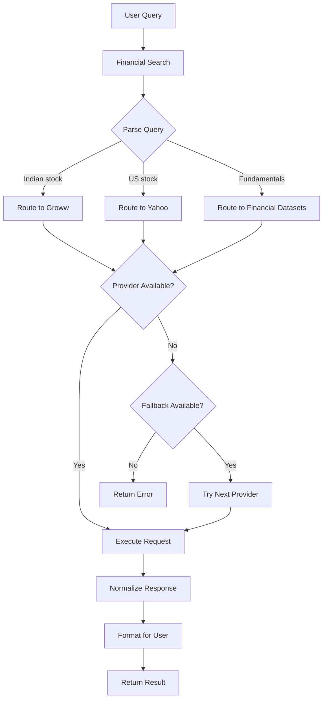
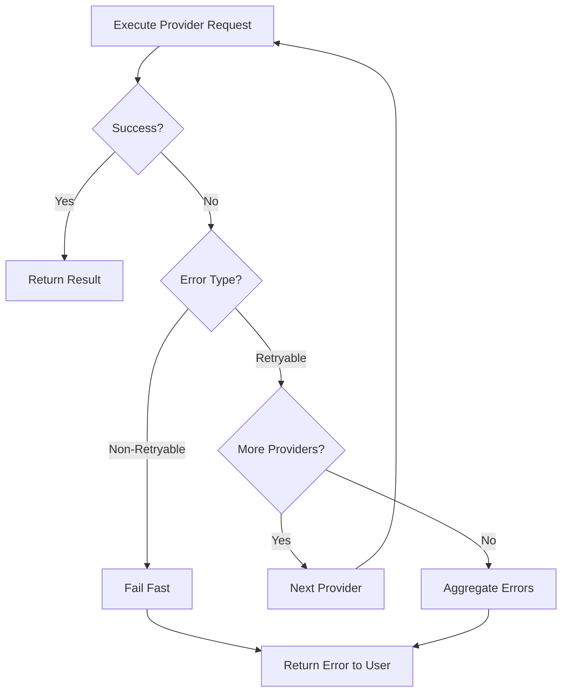
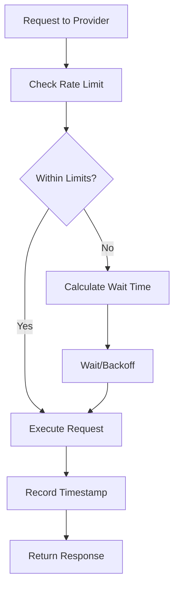

# Technical Design: Dexter Provider Abstraction Layer

**Project:** dexter-indian-api-integration  
**Phase:** Technical Design  
**Created:** February 28, 2026  
**Author:** ARES (Software Architect)  
**Task ID:** jx716wkp58dd65w6gas0cqxcks821stw  
**Workflow Run ID:** kn775k2v3ant0jqmhtffqwchcd8218vt

---

## Table of Contents

- [Section A: Backend Design](#section-a-backend-design)
  - [A1. Data Model & Schema](#a1-data-model--schema)
  - [A2. API Contracts & Interfaces](#a2-api-contracts--interfaces)
  - [A3. Business Logic](#a3-business-logic)
  - [A4. Error Handling](#a4-error-handling)
  - [A5. Security & Auth](#a5-security--auth)
- [Section B: Interface Design](#section-b-interface-design)
  - [B1. Tool Integration](#b1-tool-integration)
  - [B2. Configuration Management](#b2-configuration-management)
  - [B3. Data Flow Patterns](#b3-data-flow-patterns)
  - [B4. Testing Strategy](#b4-testing-strategy)

---

## Section A: Backend Design

### A1. Data Model & Schema

#### A1.1 Core Data Models

**StockPriceResponse (Unified)**
```typescript
interface StockPriceResponse {
  ticker: string;
  provider: 'financial-datasets' | 'groww' | 'zerodha' | 'yahoo';
  price: number | null;
  change: number | null;
  changePercent: number | null;
  marketCap: number | null;
  sharesOutstanding: number | null;
  currency: 'INR' | 'USD';
  marketState: 'open' | 'closed' | 'pre' | 'post';
  volume: number | null;
  timestamp: string; // ISO 8601
  sourceUrl: string;
}
```

**ProviderCapabilities**
```typescript
interface ProviderCapabilities {
  livePrices: boolean;
  historicalData: boolean;
  incomeStatements: boolean;
  balanceSheets: boolean;
  cashFlowStatements: boolean;
  keyRatios: boolean;
  analystEstimates: boolean;
  filings: boolean;
  insiderTrades: boolean;
  companyNews: boolean;
  orderPlacement: boolean;
  positions: boolean;
  holdings: boolean;
  markets: ('US' | 'IN' | 'GLOBAL')[];
}
```

**ProviderConfig**
```typescript
interface ProviderConfig {
  id: string;
  displayName: string;
  baseUrl: string;
  apiKeyEnvVar?: string;
  apiSecretEnvVar?: string;
  capabilities: ProviderCapabilities;
  rateLimits: Record<string, { perSecond: number; perMinute: number }>;
  requiresAuth: boolean;
}
```

**ProviderRequestContext**
```typescript
interface ProviderRequestContext {
  ticker: string;
  exchange?: string;
  startDate?: string;
  endDate?: string;
  provider?: string;
}
```

#### A1.2 Error Models

**ProviderError**
```typescript
class ProviderError extends Error {
  constructor(
    message: string,
    public provider: string,
    public code: ProviderErrorCode,
    public retryable: boolean,
    public httpStatus?: number,
    public originalError?: unknown
  ) {
    super(message);
    this.name = 'ProviderError';
  }
}

enum ProviderErrorCode {
  AUTH_MISSING = 'AUTH_MISSING',
  AUTH_FAILED = 'AUTH_FAILED',
  RATE_LIMITED = 'RATE_LIMITED',
  NOT_FOUND = 'NOT_FOUND',
  INVALID_INPUT = 'INVALID_INPUT',
  PROVIDER_ERROR = 'PROVIDER_ERROR',
  NETWORK_ERROR = 'NETWORK_ERROR',
}
```

**RateLimitConfig**
```typescript
interface RateLimitConfig {
  perSecond: number;
  perMinute: number;
}
```

#### A1.3 Zod Schemas for Validation

**StockPriceInputSchema**
```typescript
import { z } from 'zod';

export const StockPriceInputSchema = z.object({
  ticker: z.string().min(1).max(20).describe("Stock ticker symbol"),
  exchange: z.enum(['NSE', 'BSE', 'NASDAQ', 'NYSE']).optional().describe("Exchange"),
  provider: z.enum(['financial-datasets', 'groww', 'zerodha', 'yahoo', 'auto']).optional().describe("Preferred provider"),
});
```

---

### A2. API Contracts & Interfaces

#### A2.1 FinancialDataProvider Interface

```typescript
/**
 * Base interface for all financial data providers
 * All providers must implement this contract
 */
export interface FinancialDataProvider {
  /**
   * Provider configuration (static)
   */
  readonly config: ProviderConfig;

  /**
   * Check if provider is available (credentials configured)
   */
  isAvailable(): boolean;

  /**
   * Get provider capabilities
   */
  getCapabilities(): ProviderCapabilities;

  /**
   * Check if provider supports a specific capability
   */
  supportsCapability(capability: keyof ProviderCapabilities): boolean;

  /**
   * Get current stock price
   */
  getStockPrice(context: ProviderRequestContext): Promise<StockPriceResponse>;

  /**
   * Initialize provider (optional - for auth, setup)
   */
  initialize?(): Promise<void>;

  /**
   * Get historical data (optional)
   */
  getHistoricalData?(context: ProviderRequestContext): Promise<HistoricalDataResponse>;

  /**
   * Get fundamentals (optional)
   */
  getFundamentals?(context: ProviderRequestContext): Promise<FundamentalsResponse>;
}
```

#### A2.2 ProviderRegistry Interface

```typescript
/**
 * Manages provider lifecycle, routing, and fallback
 */
export interface IProviderRegistry {
  /**
   * Initialize all available providers
   */
  initialize(): Promise<void>;

  /**
   * Get provider by ID
   */
  getProvider(id: string): FinancialDataProvider | undefined;

  /**
   * Get all available providers
   */
  getAvailableProviders(): FinancialDataProvider[];

  /**
   * Get providers that support a capability
   */
  getProvidersForCapability(
    capability: keyof ProviderCapabilities
  ): FinancialDataProvider[];

  /**
   * Get best provider for capability (with optional preferred provider)
   */
  getProviderForCapability(
    capability: keyof ProviderCapabilities,
    preferredProvider?: string
  ): FinancialDataProvider | null;

  /**
   * Execute operation with fallback
   */
  executeWithFallback<T>(
    capability: keyof ProviderCapabilities,
    operation: (provider: FinancialDataProvider) => Promise<T>,
    preferredProvider?: string
  ): Promise<T>;
}
```

#### A2.3 RateLimiter Interface

```typescript
/**
 * Rate limiting utility for API requests
 */
export interface IRateLimiter {
  /**
   * Wait for rate limit token
   */
  waitForToken(endpointType: string): Promise<void>;

  /**
   * Check if request would exceed limit (non-blocking)
   */
  wouldExceedLimit(endpointType: string): boolean;

  /**
   * Get current usage stats
   */
  getUsageStats(endpointType: string): { countSecond: number; countMinute: number };
}
```

---

### A3. Business Logic

#### A3.1 Provider Selection Algorithm

```
Algorithm: getProviderForCapability(capability, preferredProvider)

Input: capability (string), preferredProvider (string | undefined)
Output: provider (FinancialDataProvider) or null

1. If preferredProvider is specified:
   a. Get provider instance
   b. If provider exists AND isAvailable() AND supportsCapability(capability):
      RETURN provider

2. Define priority order: ['financial-datasets', 'groww', 'zerodha', 'yahoo']

3. For each providerId in priority:
   a. Get provider instance
   b. If provider isAvailable() AND supportsCapability(capability):
      RETURN provider

4. RETURN null (no suitable provider found)
```

#### A3.2 Fallback with Retry Algorithm

```
Algorithm: executeWithFallback(capability, operation, preferredProvider)

Input: capability (string), operation (function), preferredProvider (string | undefined)
Output: T (operation result)

1. Get list of capable providers in priority order
2. Initialize errors array

3. For each provider in providers:
   a. Try:
      - result = await operation(provider)
      - RETURN result
   b. Catch (error):
      - If error is ProviderError AND NOT error.retryable:
          THROW error (fail fast)
      - Append error to errors array
      - Log warning: "Provider failed, trying next..."

4. THROW AggregateError(errors, "All providers failed")
```

#### A3.3 Rate Limiting Algorithm

```
Algorithm: waitForToken(endpointType)

Input: endpointType (string)
Output: void (waits if needed)

1. Get rate limit config for endpointType
2. Get current timestamps for endpointType
3. Calculate current time = Date.now()

4. Clean old timestamps:
   - recentSecond = timestamps where (current - timestamp < 1000ms)
   - recentMinute = timestamps where (current - timestamp < 60000ms)

5. If length(recentSecond) >= perSecondLimit:
   a. waitTime = 1000 - (current - recentSecond[0])
   b. Sleep(waitTime)
   c. current = Date.now()

6. If length(recentMinute) >= perMinuteLimit:
   a. waitTime = 60000 - (current - recentMinute[0])
   b. Sleep(waitTime)

7. Record current timestamp: timestamps.push(current)

8. RETURN
```

#### A3.4 Groww Auth Token Management

```
Algorithm: ensureAccessToken()

Input: none
Output: access token (string)

1. If accessToken exists AND tokenExpiry > current time:
   RETURN accessToken

2. Load GROWW_API_KEY and GROWW_API_SECRET from environment

3. If either is missing:
   THROW ProviderError(AUTH_MISSING, retryable=false)

4. Generate checksum:
   a. timestamp = Math.floor(Date.now() / 1000)
   b. checksum = SHA256(secret + timestamp)

5. POST to /v1/api/trade/token:
   {
     "key_type": "approval",
     "checksum": checksum,
     "timestamp": timestamp
   }

6. If response is error:
   THROW ProviderError(AUTH_FAILED, retryable=false)

7. Parse response:
   a. accessToken = response.payload.token
   b. tokenExpiry = new Date(response.payload.expiry)

8. RETURN accessToken
```

---

### A4. Error Handling

#### A4.1 Error Classification

| Error Type | Code | Retryable | Action |
|------------|------|-----------|--------|
| Missing Credentials | AUTH_MISSING | No | Fail fast, log error |
| Invalid Credentials | AUTH_FAILED | No | Fail fast, log error |
| Rate Limit Exceeded | RATE_LIMITED | Yes | Backoff, retry |
| Ticker Not Found | NOT_FOUND | No | Fail fast, return to user |
| Invalid Input | INVALID_INPUT | No | Fail fast, return to user |
| Provider API Error | PROVIDER_ERROR | Yes (if 5xx) | Retry with backoff |
| Network Error | NETWORK_ERROR | Yes | Retry with backoff |

#### A4.2 Retry Strategy

- **Backoff Strategy:** Exponential backoff with jitter
  - Attempt 1: 100ms
  - Attempt 2: 300ms
  - Attempt 3: 700ms
  - Attempt 4: 1500ms
  - Max attempts: 3 (per provider)

- **Non-Retryable Errors:** Immediate failover to next provider
- **Retryable Errors:** Retry current provider, then failover

#### A4.3 Error Response Format

```typescript
interface ErrorResponse {
  success: false;
  error: {
    code: string;
    message: string;
    provider?: string;
    details?: Record<string, unknown>;
    attempts?: {
      provider: string;
      error: string;
      timestamp: string;
    }[];
  };
}
```

---

### A5. Security & Auth

#### A5.1 Groww Authentication Flow

```typescript
class GrowwProvider {
  private accessToken: string | null = null;
  private tokenExpiry: Date | null = null;

  private async ensureAccessToken(): Promise<string> {
    // Check if token is still valid
    if (this.accessToken && this.tokenExpiry && this.tokenExpiry > new Date()) {
      return this.accessToken;
    }

    // Load credentials
    const apiKey = process.env.GROWW_API_KEY;
    const apiSecret = process.env.GROWW_API_SECRET;

    if (!apiKey || !apiSecret) {
      throw new ProviderError(
        'Groww API credentials not configured',
        'groww',
        'AUTH_MISSING',
        false
      );
    }

    // Generate checksum
    const timestamp = Math.floor(Date.now() / 1000).toString();
    const checksum = crypto
      .createHash('sha256')
      .update(apiSecret + timestamp)
      .digest('hex');

    // Request access token
    const response = await fetch(`${this.config.baseUrl}/v1/api/trade/token`, {
      method: 'POST',
      headers: {
        'Authorization': apiKey,
        'Content-Type': 'application/json',
      },
      body: JSON.stringify({
        key_type: 'approval',
        checksum,
        timestamp,
      }),
    });

    if (!response.ok) {
      throw new ProviderError(
        'Failed to obtain Groww access token',
        'groww',
        'AUTH_FAILED',
        false,
        response.status
      );
    }

    const data = await response.json();
    this.accessToken = data.payload.token;
    this.tokenExpiry = new Date(data.payload.expiry);

    return this.accessToken;
  }

  private async getAuthHeaders(): Promise<Record<string, string>> {
    const token = await this.ensureAccessToken();
    return {
      'Authorization': `Bearer ${token}`,
      'Accept': 'application/json',
      'X-API-VERSION': '1.0',
    };
  }
}
```

#### A5.2 Zerodha Authentication Flow

```typescript
class ZerodhaProvider {
  private accessToken: string | null = null;

  async initialize(): Promise<void> {
    const apiKey = process.env.ZERODHA_API_KEY;
    const apiSecret = process.env.ZERODHA_API_SECRET;

    if (!apiKey || !apiSecret) {
      console.warn('Zerodha credentials not configured');
      return;
    }

    // Note: In production, user needs to login via browser
    // to get request_token, then exchange for access_token
    // This is simplified for read-only mode
    this.accessToken = process.env.ZERODHA_ACCESS_TOKEN;
  }

  private getAuthHeaders(): Record<string, string> {
    return {
      'Authorization': `token ${process.env.ZERODHA_API_KEY}:${this.accessToken}`,
      'Content-Type': 'application/json',
    };
  }
}
```

#### A5.3 Financial Datasets Authentication

```typescript
class FinancialDatasetsProvider {
  private getAuthHeaders(): Record<string, string> {
    const apiKey = process.env.FINANCIAL_DATASETS_API_KEY;
    if (!apiKey) {
      throw new ProviderError(
        'Financial Datasets API key not configured',
        'financial-datasets',
        'AUTH_MISSING',
        false
      );
    }
    return {
      'x-api-key': apiKey,
      'Content-Type': 'application/json',
    };
  }
}
```

#### A5.4 Security Best Practices

1. **Never log credentials** - Redact any token/key from logs
2. **Validate all inputs** - Use Zod schemas for all user inputs
3. **HTTPS only** - Enforce TLS for all API calls
4. **Credential rotation** - Support rotating credentials without restart
5. **Token lifecycle** - Auto-refresh tokens before expiry
6. **Audit logging** - Log all API calls with timestamp and provider (no credentials)

---

## Section B: Interface Design

### B1. Tool Integration

#### B1.1 Stock Price Tool (Refactored)

```typescript
// src/tools/finance/stock-price-v2.ts
import { DynamicStructuredTool } from '@langchain/core/tools';
import { z } from 'zod';
import { providerRegistry } from './providers/index.js';
import { formatToolResult } from '../types.js';

const StockPriceInputSchema = z.object({
  ticker: z.string()
    .min(1)
    .max(20)
    .describe("Stock ticker symbol (e.g., 'RELIANCE', 'AAPL')"),
  exchange: z.enum(['NSE', 'BSE', 'NASDAQ', 'NYSE'])
    .optional()
    .describe("Exchange code"),
  provider: z.enum(['financial-datasets', 'groww', 'zerodha', 'yahoo', 'auto'])
    .optional()
    .describe("Preferred data provider (default: auto)"),
});

export const getStockPriceV2 = new DynamicStructuredTool({
  name: 'get_stock_price',
  description: `Fetch current stock price with provider routing:
- Indian stocks (NSE/BSE) → Groww → Zerodha → Yahoo
- US stocks (NASDAQ/NYSE) → Yahoo → Financial Datasets
- Specify provider parameter to override`,
  schema: StockPriceInputSchema,
  func: async (input) => {
    const ticker = input.ticker.trim().toUpperCase();

    // Determine preferred provider based on exchange
    let preferredProvider = input.provider === 'auto' ? undefined : input.provider;
    if (!preferredProvider && input.exchange) {
      const isIndian = ['NSE', 'BSE'].includes(input.exchange);
      preferredProvider = isIndian ? 'groww' : 'yahoo';
    }

    // Get provider for live prices capability
    const provider = providerRegistry.getProviderForCapability(
      'livePrices',
      preferredProvider
    );

    if (!provider) {
      return formatToolResult({
        error: 'No provider available for stock prices',
        ticker,
        exchange: input.exchange,
      }, []);
    }

    try {
      const price = await provider.getStockPrice({
        ticker,
        exchange: input.exchange,
      });
      return formatToolResult(price, [price.sourceUrl]);
    } catch (error) {
      if (error instanceof ProviderError) {
        return formatToolResult({
          error: error.message,
          code: error.code,
          provider: error.provider,
          ticker,
        }, []);
      }
      return formatToolResult({
        error: error instanceof Error ? error.message : String(error),
        ticker,
      }, []);
    }
  },
});
```

#### B1.2 Fundamentals Tool (Refactored)

```typescript
// src/tools/finance/fundamentals-v2.ts
import { DynamicStructuredTool } from '@langchain/core/tools';
import { z } from 'zod';
import { providerRegistry } from './providers/index.js';
import { formatToolResult } from '../types.js';

const FundamentalsInputSchema = z.object({
  ticker: z.string()
    .min(1)
    .max(20)
    .describe("Stock ticker symbol"),
  provider: z.enum(['financial-datasets', 'auto'])
    .optional()
    .describe("Data provider (default: auto)"),
});

export const getFundamentalsV2 = new DynamicStructuredTool({
  name: 'get_fundamentals',
  description: `Fetch fundamental financial data (income, balance, cash flow):
- Income statements, balance sheets, cash flow
- Uses Financial Datasets API (only provider with fundamentals)`,
  schema: FundamentalsInputSchema,
  func: async (input) => {
    const ticker = input.ticker.trim().toUpperCase();

    // Get provider for income statements capability
    const provider = providerRegistry.getProviderForCapability(
      'incomeStatements',
      input.provider === 'auto' ? undefined : input.provider
    );

    if (!provider) {
      return formatToolResult({
        error: 'No provider available for fundamentals',
        ticker,
      }, []);
    }

    try {
      if (!provider.getFundamentals) {
        return formatToolResult({
          error: 'Provider does not support fundamentals',
          provider: provider.config.id,
        }, []);
      }

      const fundamentals = await provider.getFundamentals({ ticker });
      return formatToolResult(fundamentals, []);
    } catch (error) {
      return formatToolResult({
        error: error instanceof Error ? error.message : String(error),
        ticker,
      }, []);
    }
  },
});
```

#### B1.3 Financial Search Meta-Tool (Updated)

```typescript
// src/tools/finance/financial-search-v2.ts
import { z } from 'zod';
import { providerRegistry } from './providers/index.js';
import { getStockPriceV2 } from './stock-price-v2.js';
import { getFundamentalsV2 } from './fundamentals-v2.js';
import { getHistoricalDataV2 } from './historical-data-v2.js';
import { callLlm } from '../../model/llm.js';

const FINANCE_TOOLS: StructuredToolInterface[] = [
  getStockPriceV2,
  getFundamentalsV2,
  getHistoricalDataV2,
  // Add more tools as needed
];

export async function financialSearch(query: string, model: string) {
  // Build routing prompt with provider awareness
  const systemPrompt = `You are a financial data routing assistant.
Available tools: ${FINANCE_TOOLS.map(t => t.name).join(', ')}.

Provider capabilities:
- Groww: Indian stocks (NSE, BSE, MCX), live prices, orders, positions
- Zerodha: Indian stocks, live prices, historical data, WebSocket
- Yahoo Finance: Global stocks, live prices, historical data
- Financial Datasets: US stocks, fundamentals (income, balance, cash flow)

Route queries to the best provider based on:
1. Market (Indian vs US vs Global)
2. Data type required (prices vs fundamentals vs historical)
3. User's preferred provider (if specified)`;

  const { response } = await callLlm(query, {
    model,
    systemPrompt,
    tools: FINANCE_TOOLS,
  });

  return response;
}
```

---

### B2. Configuration Management

#### B2.1 Environment Variables

```bash
# Existing (unchanged)
FINANCIAL_DATASETS_API_KEY=your-financial-datasets-api-key

# New - Groww
GROWW_API_KEY=your-groww-api-key
GROWW_API_SECRET=your-groww-api-secret

# New - Zerodha (optional)
ZERODHA_API_KEY=your-zerodha-api-key
ZERODHA_API_SECRET=your-zerodha-api-secret
ZERODHA_ACCESS_TOKEN=your-access-token  # From login flow

# New - Provider routing flags
ENABLE_PROVIDER_ROUTING=true
DEFAULT_PROVIDER_INDIAN=groww  # or 'zerodha'
DEFAULT_PROVIDER_US=yahoo
LOG_PROVIDER_DEBUG=false
```

#### B2.2 Provider Registry Initialization

```typescript
// src/tools/registry.ts
import { providerRegistry } from './finance/providers/index.js';

export async function initializeToolRegistry() {
  // Initialize providers
  await providerRegistry.initialize();

  // Log available providers
  const available = providerRegistry.getAvailableProviders();
  console.log(`Initialized ${available.length} providers:`, 
    available.map(p => p.config.id).join(', '));

  // Return tool registry
  return getToolRegistry(process.env.MODEL || 'gpt-4');
}
```

---

### B3. Data Flow Patterns

#### B3.1 Provider Routing Flow



#### B3.2 Error Handling Flow



#### B3.3 Rate Limiting Flow



---

### B4. Testing Strategy

#### B4.1 Unit Test Structure

```typescript
// tests/providers/provider-registry.test.ts
import { describe, it, expect, beforeAll } from 'bun:test';
import { ProviderRegistry } from '../../src/tools/finance/providers/provider-registry.js';

describe('ProviderRegistry', () => {
  let registry: ProviderRegistry;

  beforeAll(() => {
    registry = new ProviderRegistry();
  });

  it('should initialize all providers', async () => {
    await registry.initialize();
    const available = registry.getAvailableProviders();
    expect(available.length).toBeGreaterThan(0);
  });

  it('should select Groww for Indian stocks', () => {
    const provider = registry.getProviderForCapability('livePrices', 'groww');
    expect(provider?.config.id).toBe('groww');
  });

  it('should fallback to Yahoo if Groww unavailable', () => {
    const provider = registry.getProviderForCapability('livePrices', 'yahoo');
    expect(provider?.config.id).toBe('yahoo');
  });

  it('should execute with fallback on provider failure', async () => {
    let attempts = 0;
    const failingProvider = {
      async getStockPrice() {
        attempts++;
        if (attempts === 1) {
          throw new ProviderError('Temp failure', 'test', 'PROVIDER_ERROR', true);
        }
        return { ticker: 'TEST', price: 100 };
      }
    };

    const result = await registry.executeWithFallback('livePrices', (p) => p.getStockPrice({ ticker: 'TEST' }));
    expect(result.price).toBe(100);
    expect(attempts).toBeGreaterThan(1);
  });
});
```

#### B4.2 Integration Test Structure

```typescript
// tests/providers/groww-provider.integration.test.ts
import { describe, it, expect, beforeAll, afterAll } from 'bun:test';
import { GrowwProvider } from '../../src/tools/finance/providers/groww-provider.js';

describe('GrowwProvider Integration', () => {
  let provider: GrowwProvider;

  beforeAll(() => {
    provider = new GrowwProvider();
  });

  afterAll(() => {
    // Cleanup
  });

  it('should initialize with valid credentials', async () => {
    await provider.initialize();
    expect(provider.isAvailable()).toBe(true);
  });

  it('should fetch stock price for RELIANCE', async () => {
    const price = await provider.getStockPrice({
      ticker: 'RELIANCE',
      exchange: 'NSE',
    });

    expect(price.ticker).toBe('RELIANCE');
    expect(price.provider).toBe('groww');
    expect(price.currency).toBe('INR');
    expect(price.price).toBeGreaterThan(0);
  });

  it('should handle invalid ticker', async () => {
    await expect(
      provider.getStockPrice({ ticker: 'INVALID_TICKER' })
    ).rejects.toThrow();
  });
});
```

#### B4.3 Contract Test Structure

```typescript
// tests/providers/contract.test.ts
import { describe, it, expect } from 'bun:test';
import { providerRegistry } from '../../src/tools/finance/providers/index.js';
import type { StockPriceResponse } from '../../src/tools/finance/providers/types.js';

describe('Provider Contract Tests', () => {
  it('should normalize stock price response correctly', async () => {
    const providers = providerRegistry.getAvailableProviders();

    for (const provider of providers) {
      if (provider.supportsCapability('livePrices')) {
        const response = await provider.getStockPrice({
          ticker: 'AAPL',
        });

        // Verify contract compliance
        expect(response).toHaveProperty('ticker');
        expect(response).toHaveProperty('provider');
        expect(response).toHaveProperty('price');
        expect(response).toHaveProperty('currency');
        expect(response).toHaveProperty('timestamp');
        expect(response).toHaveProperty('sourceUrl');
        expect(response.currency).toMatch(/^(INR|USD)$/);
        expect(response.timestamp).toMatch(/^\d{4}-\d{2}-\d{2}T/);
      }
    }
  });
});
```

---

## Appendix A: Implementation Checklist

- [ ] Create provider types and interfaces (`src/tools/finance/providers/types.ts`)
- [ ] Implement base provider class (`src/tools/finance/providers/base-provider.ts`)
- [ ] Implement rate limiter (`src/tools/finance/providers/rate-limiter.ts`)
- [ ] Implement provider registry (`src/tools/finance/providers/provider-registry.ts`)
- [ ] Implement Groww provider (`src/tools/finance/providers/groww-provider.ts`)
- [ ] Implement Zerodha provider (`src/tools/finance/providers/zerodha-provider.ts`)
- [ ] Implement Yahoo Finance provider (`src/tools/finance/providers/yahoo-provider.ts`)
- [ ] Wrap existing Financial Datasets API (`src/tools/finance/providers/financial-datasets-provider.ts`)
- [ ] Update stock-price tool to use registry (`src/tools/finance/stock-price.ts`)
- [ ] Update fundamentals tool to use registry (`src/tools/finance/fundamentals.ts`)
- [ ] Update financial-search meta-tool (`src/tools/finance/financial-search.ts`)
- [ ] Update tool registry initialization (`src/tools/registry.ts`)
- [ ] Add environment variables to `.env.example`
- [ ] Write unit tests for provider interfaces
- [ ] Write unit tests for rate limiter
- [ ] Write unit tests for provider registry
- [ ] Write integration tests for each provider
- [ ] Write contract tests for response normalization
- [ ] Update documentation and README

---

## Appendix B: Migration Guide

### Step 1: Add Provider Layer (Non-Breaking)
```bash
# Create provider directory
mkdir -p src/tools/finance/providers

# Implement all provider files
# See Appendix A for full file list
```

### Step 2: Update Tool Registry
```typescript
// src/tools/registry.ts
import { providerRegistry } from './finance/providers/index.js';

export async function getToolRegistry(model: string) {
  // Initialize providers before loading tools
  await providerRegistry.initialize();
  
  // ... rest of registry
}
```

### Step 3: Update Tool Exports
```typescript
// src/tools/finance/index.ts
export { getStockPriceV2 as getStockPrice } from './stock-price-v2.js';
export { getFundamentalsV2 as getFundamentals } from './fundamentals-v2.js';
```

### Step 4: Feature Flag Rollout
```bash
# .env
ENABLE_PROVIDER_ROUTING=true
```

### Step 5: Monitor and Validate
```bash
# Check logs for provider selection
bun run dev 2>&1 | grep "Provider selected"
```

---

*Document Version: 1.0*  
*Next Phase: Implementation (Hephaestus)*
